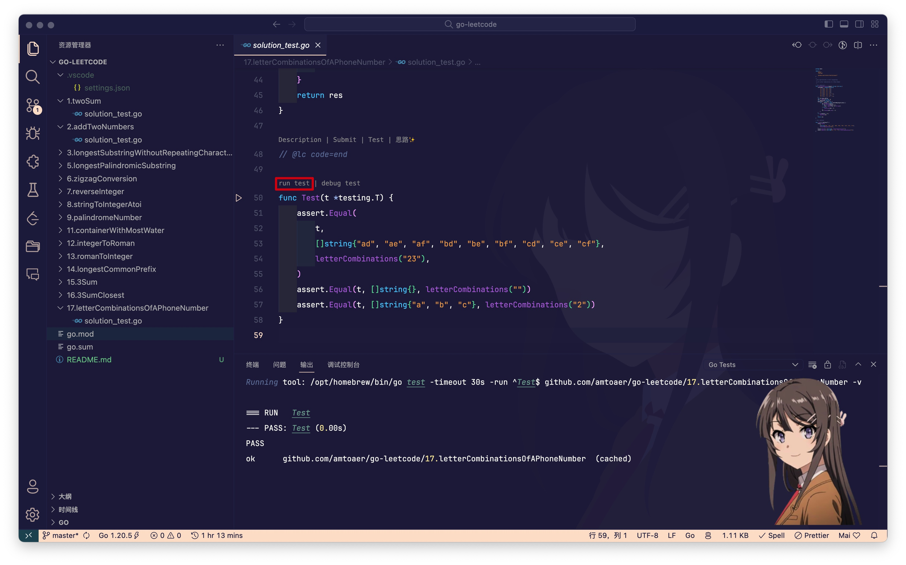

## 力扣刷题仓库

最近心血来潮想要刷题，使用 vscode 打开刷题仓库后发现之前的目录结构有不少的问题：
1. 文件夹是中文导致 go mod 无法识别（之前能够正常单测是因为 goland 会将单测拷贝到一个纯英文的临时目录）
2. 很多旧题目的内置数据类型没有被包含在内，导致即使将文件夹更名并正常识别后也会出现语法错误

于是决定甩开历史包袱，将过往的代码全部移除。这次 remake 主要为了确保：
1. 打开刷题仓库目录，所有文件都能被正常识别
2. 每个文件都有单独的单元测试，可供批量运行

实现方式：
1. 在项目根目录创建 golang 项目
   ```bash
    go mod init github.com/amtoaer/leetcode
   ```
2. 安装 labuladong 的 vscode-leetcode 插件
3. 将刷题语言设置为 go，文件保存目录设置为项目根目录
   ```json
    "leetcode.workspaceFolder": "/Users/amtoaer/Documents/code/go/go-leetcode",
    "leetcode.defaultLanguage": "golang",
   ```
4. 设置文件保存的具体路径（英文无空格）和带有单元测试的文件模板
   ```json
    "leetcode.filePath": {
        "default": {
        "folder": "${id}.${camelCaseName}",
        "filename": "solution_test.${ext}"
        }
    },
    "leetcode.codeTemplate": "package main\n\nimport (\n\t\"testing\"\n)\n\n${code}\n\nfunc Test(t *testing.T) {\n}",
   ```
5. gofmt 不会限制行长度，可能会出现过长的代码行，换用 golines 做代码格式化
   ```json
    "editor.formatOnSave": true,
    "go.alternateTools": {
        "customFormatter": "/Users/amtoaer/.go/bin/golines"
    },
    "go.formatTool": "custom"
   ```
----
贴几张经过配置后的刷题图片：
1. 刷题

2. 代码补全

3. 单测

4. 批量单测

---
什么，你问我测试样例是不是自己打的？

当然不是！这种工作 copilot 会为你效劳的。输入 assert.Equal，多敲几个 tab，测试样例就全有啦！

